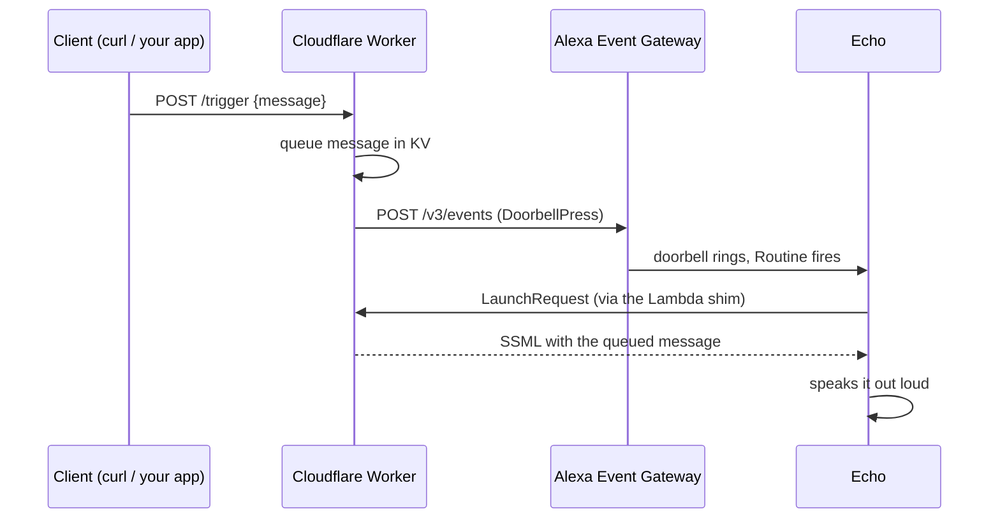

# knock-my-alexa

Make Alexa ring a doorbell and speak your own message from a plain HTTP request: a self-hosted alternative to Voice Monkey, built on Cloudflare Workers with a minimal AWS Lambda shim.

```
curl -X POST https://<your-worker>/trigger \
  -H "Authorization: Bearer <TRIGGER_TOKEN>" \
  -H "content-type: application/json" \
  -d '{"message":"Someone knocked on the website"}'

→ the virtual doorbell rings → your Routine runs → the Echo speaks the message
```

## How it works

Two official Alexa mechanisms, combined:

1. **Doorbell events trigger Routines.** A private Smart Home skill registers a virtual doorbell with Alexa. When you call `/trigger`, the Worker posts a `DoorbellPress` event to the Alexa Event Gateway. As far as Alexa is concerned the doorbell really rang, so the Routine fires.
2. **A custom skill speaks dynamic content.** Routines cannot carry a payload, so `/trigger` also queues your message (plain text or SSML) in KV. The Routine's "open skill" action then launches a small custom skill, which replies with the queued SSML, and the Echo speaks it.



During setup, Alexa also sends Smart Home directives (`Discovery`, `AcceptGrant`, `ReportState`) to the skill endpoint. Amazon requires that endpoint to be an AWS Lambda, so a tiny shim forwards everything to the Worker and relays the response back.

## Components

| Piece | Where | Role |
|---|---|---|
| Worker (`worker/`) | Cloudflare | All logic: Alexa directives, LWA token storage in KV, the message queue, the `/trigger` API |
| Lambda shim (`lambda/`) | AWS | Forwards all skill traffic to the Worker (Smart Home skills must use a Lambda endpoint) |
| Smart Home skill | Alexa Developer Console | Declares the virtual doorbell; stays in development mode, which works indefinitely on your own account |
| Custom skill | Alexa Developer Console | Opened by the Routine; speaks whatever `/trigger` queued |

Want several independent triggers? Declare more doorbells in `worker/src/directives.ts`, one Routine each.

## Setup

Step-by-step walkthrough (CLI commands plus the Alexa console clicks): [docs/setup.md](docs/setup.md).

## Secret handling

No credentials ever live in this repo. Local dev secrets go in `.dev.vars` (gitignored); deployed secrets go through `wrangler secret put`. Guard rails:

- `scripts/check-secrets.sh` scans staged changes and tracked files for credential patterns
- `.githooks/pre-commit` runs it on every commit. Enable once per clone:

  ```sh
  git config core.hooksPath .githooks
  ```

- `.claude/settings.json` makes Claude Code run the same scan before any `git commit` or `git push`
