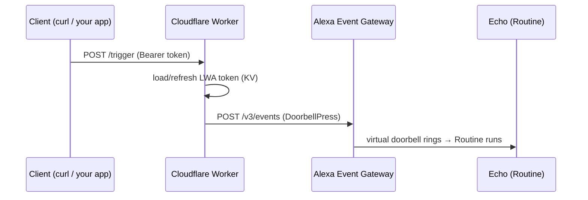

# knock-my-alexa

Trigger Alexa Routines with a plain HTTP request — a self-hosted alternative to Voice Monkey, built on Cloudflare Workers with a minimal AWS Lambda shim.

```
curl -X POST https://<your-worker>/trigger -H "Authorization: Bearer <TRIGGER_TOKEN>"
→ a virtual doorbell "rings" → your Alexa Routine runs (announcement, lights, anything)
```

## How it works

Alexa Routines can be triggered by smart-home events such as a doorbell press. This project registers a **virtual doorbell** with Alexa through a private Smart Home skill. When you call the trigger endpoint, the Worker posts a `DoorbellPress` event to the Alexa Event Gateway — as far as Alexa is concerned the doorbell really rang, so the Routine fires.



The reverse direction only happens during setup: when the skill is enabled, Alexa sends directives (`Discovery`, `AcceptGrant`, `ReportState`) to the skill endpoint. Amazon requires that endpoint to be an AWS Lambda, so a ~20-line shim forwards those directives to the Worker and relays the response back.

## Components

| Piece | Where | Role |
|---|---|---|
| Worker (`worker/`) | Cloudflare | All logic: Alexa directive handling (Discovery / AcceptGrant / ReportState), LWA token storage in KV, the `/trigger` API |
| Lambda shim (`lambda/`) | AWS | Forwards skill directives to the Worker — required because Smart Home skills must use a Lambda endpoint |
| Smart Home skill | Alexa Developer Console | Declares the virtual doorbell; stays in development mode, which works indefinitely on your own account |

Known limitation: Routines cannot receive a payload, so each virtual doorbell maps to one fixed Routine. Need different messages? Declare more doorbells — one Routine each.

## Secret handling

No credentials ever live in this repo. Local dev secrets go in `.dev.vars` (gitignored); deployed secrets go through `wrangler secret put`. Guard rails:

- `scripts/check-secrets.sh` scans staged changes / tracked files for credential patterns
- `.githooks/pre-commit` runs it on every commit — enable once per clone:

  ```sh
  git config core.hooksPath .githooks
  ```

- `.claude/settings.json` makes Claude Code run the same scan before any `git commit` / `git push`
